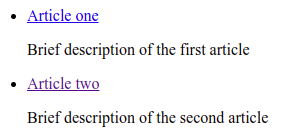

<a name="readme-top"></a>

<!-- PROJECT SHIELDS -->
<!--
*** I'm using markdown "reference style" links for readability.
*** Reference links are enclosed in brackets [ ] instead of parentheses ( ).
*** See the bottom of this document for the declaration of the reference variables
*** for contributors-url, forks-url, etc. This is an optional, concise syntax you may use.
*** https://www.markdownguide.org/basic-syntax/#reference-style-links
-->

[![Contributors][contributors-shield]][contributors-url]
[![Forks][forks-shield]][forks-url]
[![Stargazers][stars-shield]][stars-url]
[![Issues][issues-shield]][issues-url]
[![MIT License][license-shield]][license-url]

Read in other languages: [Russian](README.ru.md)

<!-- PROJECT LOGO -->
<br />
<div align="center">
  <a href="https://github.com/injashkin/md-pug-to-html">  
    
  </a>

<h3 align="center">MdPugToHtml</h3>

  <p align="center">
    Compiles HTML pages from Markdown files based on the Pug template.
    <br />
    <a href="https://github.com/injashkin/md-pug-to-html"><strong>Explore the docs »</strong></a>
    <br />
    <br />
    <a href="https://github.com/injashkin/md-pug-to-html">View Demo</a>
    ·
    <a href="https://github.com/injashkin/md-pug-to-html/issues">Report Bug</a>
    ·
    <a href="https://github.com/injashkin/md-pug-to-html/issues">Request Feature</a>
  </p>
</div>

<!-- TABLE OF CONTENTS -->
<details>
  <summary>Table of Contents</summary>
  <ol>
    <li>
      <a href="#about-the-project">About The Project</a>
      <ul>
        <li><a href="#built-with">Built With</a></li>
      </ul>
    </li>
    <li><a href="#installation">Installation</a></li>   
    <li>
      <a href="#using-CLI">Using CLI</a>
      <ul>
        <li><a href="#the-easy-way"> The easy way</a></li>
        <li><a href="#advanced-way">Advanced way</a></li>
      </ul>
    </li>    
    <li><a href="#using-API">Using API</a></li>
    <li><a href="#roadmap">Roadmap</a></li>
    <li><a href="#contributing">Contributing</a></li>
    <li><a href="#license">License</a></li>
    <li><a href="#contact">Contact</a></li>
    <li><a href="#acknowledgments">Acknowledgments</a></li>
    <li><a href="#additionally">Additionally</a></li>
  </ol>
</details>

<!-- ABOUT THE PROJECT -->

## About The Project

MdPugToHtml can massively convert Markdown files to HTML pages. In this case, a Pug template can be specified, according to which all these pages will be converted.
These pages are saved in the specified directory while preserving the full structure of the source directory (with Markdown files). Markdown files may contain Frontmatter[1] data. This data will be used as metadata of HTML pages.

The need for MdPugToHtml appeared when creating the project builder [npm-for-frontend](https://github.com/injashkin/npm-for-frontend), but MdPugToHtml can be used independently.

[1] Markdown Frontmatter is a section marked with three hyphens `---` at the beginning of the markdown file, which has the YAML/YAML format. Here is an example of frontmatter markdown in YAML format:

```
---
title: A quick guide to Git commands
created: 2019-05-20
---

## Useful commands for working with Git and Github
```

<p align="right">(<a href="#readme-top">back to top</a>)</p>

### Built With

- [![Node.js][nodejs.org]][nodejs-url]
- [![Pug][pug.js]][pug-url]
- [![gray-matter][gray-matter]][graymatter-url]
- [![markdown-to-pug][markdown-to-pug]][markdowntopug-url]

<p align="right">(<a href="#readme-top">back to top</a>)</p>

## Installation

```
npm i -D md-pug-to-html
```

<p align="right">(<a href="#readme-top">back to top</a>)</p>

<!-- USAGE EXAMPLES -->

## Using CLI

### The easy way

This method allows you to convert these files into HTML pages by specifying just a directory with Markdown files. And, additionally, get a file with a list of converted files, as well as a Pug template file, on the basis of which all Markdown files were converted to HTML files.

Open a terminal, create a directory, for example, `my-site`, and navigate to it:

```
mkdir my-site
cd my-site
```

Create a `package.json` file, to do this, enter the following command in the terminal:

```
npm init -y
```

Install MdPugToHtml:

```
npm i -D md-pug-to-html
```

In the `package.json` file, use the `-i` key to specify the directory where the Markdown files are located:

```json
"scripts": {
  "start": "md-pug-to-html -i=content",
}
```

The `content` directory is specified here. This means that it must be located in the same directory as the `package.json` file. If the Markdown files are located in a different location, specify a different path, for example:

```json
"scripts": {
  "start": "md-pug-to-html -i=/home/my/articles",
}
```

From the `my-site` directory in the terminal, run the command:

```
npm run start
```

As a result, a `docs` directory will be created, which will contain HTML pages converted from Markdown files.

Also, two files will be created that may be useful to you:

- file `src/data/link-list.pug`, which will contain an array of objects. This array can be used to create a list of links to articles in blog format. How to do this, see [Advanced way](#advanced-way).

- file `src/article/index.pug` with the Pug template, according to which all HTML pages are formatted. You can change the template and restart the `npm run start` command again. The articles will be reformatted according to the new template.

### Advanced way

Open a terminal, create a directory, for example, `my-site`, and navigate to it:

```
mkdir my-site
cd my-site
```

Create a `package.json` file, to do this, enter the following command in the terminal:

```
npm init -y
```

Install MdPugToHtml:

```
npm i -D md-pug-to-html
```

In the root directory of the project, create a directory in which you want to post articles. Let it be the `content` directory, and in it create a couple of subdirectories `article1` and `article2`. In each of these two directories, create one file named `index.md `.

Copy the following to the `content/article1/index.md` file:

```
---
title: Article one
description: Brief description of the first article
create: 2022-08-10
---

## Title h2 in the first article
```

Copy the following to the `content/article2/index.md` file:

```
---
title: Article two
description: Brief description of the second article
create: 2022-08-11
---

## Title h2 in the second article
```

Now, in the root directory of the project, create the `src` directory, and in it the `article` directory, where you create the `index.pug` file with the following content:

```pug
block variables

doctype html
html(lang= 'en')
  head
    meta(charset= 'utf-8')
    meta(name= 'viewport' content= 'width=device-width, initial-scale=1')
    meta(name= 'description' content= description)
    title= title

  body
    block main
      .content
        .article
          .creationDate= `Created: ${create}`
          include from-md.pug
```

In the `package.json` file, configure MdPugToHtml with the necessary parameters:

```json
"scripts": {
  "start": "md-pug-to-html -i=content -t=src/article",
}
```

Parameter values are set using keys:

- key `-i` - path to the directory where the markdown files are located (required)
- key `-o` - path to the project's build directory (default `docs`)
- key `-t` - path to the directory of the article template named `index.pug` (by default `src/article`)
- key `-d` - path to the directory where the `linkList.pug` file will be generated (default `src/data`)

From the root directory of the project in the terminal, run the command:

```
npm run start
```

As a result, MdPugToHtml will do the following:

- creates the `docs` directory (if it was missing)

- recursively traverses the subdirectories `article1` and `article2` in the `content` directory and finds files in them `index.md `.

- converts files `index.md ` to pages `index.html ` in accordance with the template `src/article/index.pug` and will place these pages in the `docs` directory while preserving the entire structure of the subdirectories of the `content` directory, i.e. the `article1` and `article2` subdirectories will be created in the `docs` directory.

To file `docs/article1/index.html` the following will be compiled:

```html
<!DOCTYPE html>
<html lang="en">
  <head>
    <meta charset="utf-8" />
    <meta name="viewport" content="width=device-width, initial-scale=1" />
    <meta name="description" content="Brief description of the first article" />
    <title>Article one</title>
  </head>
  <body>
    <div class="content">
      <div class="article">
        <div class="creationDate">Created: Aug 10 2022</div>
        <h2>Title h2 in the first article</h2>
      </div>
    </div>
  </body>
</html>
```

To file `docs/article2/index.html` the following will be compiled:

```html
<!DOCTYPE html>
<html lang="en">
  <head>
    <meta charset="utf-8" />
    <meta name="viewport" content="width=device-width, initial-scale=1" />
    <meta
      name="description"
      content="Brief description of the second article"
    />
    <title>Article two</title>
  </head>
  <body>
    <div class="content">
      <div class="article">
        <div class="creationDate">Created: Aug 11 2022</div>
        <h2>Title h2 in the second article</h2>
      </div>
    </div>
  </body>
</html>
```

- MdPugToHtml will generate a file `src/data/linkList.pug`, which will contain an array of objects called `points`. Each array object has properties:
  - `pathFile` - path to the file `index.html`
  - `title` - article title
  - `description` - brief description of the article

The file `src/data/linkList.pug` can be used to create a list of links to articles in blog format. Below is an example of how this can be used.

Create a page template where a list of articles will be displayed. To do this, create a file `list.pug` in the `src` directory, and copy the following into it:

```pug
block variables

  include ./data/link-list.pug

doctype html
html(lang= 'en')
  head
    meta(charset= 'utf-8')
    meta(name= 'viewport' content= 'width=device-width, initial-scale=1')

block main
  .content
    .creationDate= pageCreated
    ul.list__box
      each point in points
        li
          a.list__item(href=point.pathFile)= point.title
          p= point.description
```

In `package.json` file, add a line marked with a `+`:

```json
"scripts": {
  "start": "md-pug-to-html -i=content -t=src/pages/article",
+ "pug": "pug --pretty src/list.pug -o docs",
}
```

From the root directory of the project in the terminal, run the following command:

```
npm run pug
```

A file will be created `docs/list.html ` the following content:

```html
<!DOCTYPE html>
<html lang="en">
  <head>
    <meta charset="utf-8" />
    <meta name="viewport" content="width=device-width, initial-scale=1" />
  </head>
</html>
<div class="content">
  <div class="creationDate"></div>
  <ul class="list__box">
    <li>
      <a class="list__item" href="article1/index.html">Article one</a>
      <p>Brief description of the first article</p>
    </li>
    <li>
      <a class="list__item" href="article2/index.html">Article two</a>
      <p>Brief description of the second article</p>
    </li>
  </ul>
</div>
```

If you open this file in a browser, you will see a list of links to articles with a brief description:



Clicking on the link will take you to the selected article.

## Using API

```js
const mpth = require('md-pug-to-html');

const options = {
  sourceDir: 'content',
  templateDir: 'src/article',
};

// Initialization
mpth.init(options);

// List of created pages
const list = mpth.getList();
```

In `options` you can specify:

- `sourceDir` - directory with Markdown articles (required)
- `templateDir` - directory with a template for article pages (required)
- `destinationDir` - usually, this is the project's build directory (by default `destinationDir: 'docs'`)
- `dataOutDir` - the directory where the `link-list.pug` file will be stored (by default `dataOutDir: 'src/data',`)

`init()` results in the creation of all files specified in [Using CLI](#using-CLI).

`getList()` returns a list of created pages in the form of an array of objects, each object of which contains:

- `pathFile` - the path to the article page file `index.html `
- `title` - article title
- `description` - brief description of the article

For more information, see [Using CLI](#using-CLI).

<p align="right">(<a href="#readme-top">back to top</a>)</p>

<!-- ROADMAP -->

## Roadmap

See the [open issues](https://github.com/injashkin/md-pug-to-html/issues) for a full list of proposed features (and known issues).

<p align="right">(<a href="#readme-top">back to top</a>)</p>

<!-- CONTRIBUTING -->

## Contributing

You can provide any assistance to the project. Take part in it or suggest improvements by opening issues. Any contribution you make will be appreciated. Don't forget to add a star to the project! Thank you in advance!

If you have an idea that will make the project better, you can fork the repository and create a pull request:

1. Fork the Project
2. Create your Feature Branch (git checkout -b injashkin/md-pug-to-html)
3. Make changes to the code
4. Commit your Changes (git commit -m 'Добавлено то-то и то-то')
5. Push to the Branch (git push origin injashkin/md-pug-to-html)
6. Open a Pull Request

<p align="right">(<a href="#readme-top">back to top</a>)</p>

## Contact

Igor Jashkin - injashkin@gmail.com - https://t.me/jashkin

Project Link: https://github.com/injashkin/md-pug-to-html

<!-- ACKNOWLEDGMENTS -->

## Acknowledgments

- [This README is based on the Best-README-Template template](https://github.com/othneildrew/Best-README-Template)

- [A project from John Gruber, the creator of Markdown](https://daringfireball.net/projects/markdown/)

- [An interesting project about Markdown](https://www.markdownguide.org)

## Additionally

Packages that may be useful:

- [markdown-to-pug](https://www.npmjs.com/package/markdown-to-pug) - converts Markdown to Pug

- [markdown-front-matter-json](https://github.com/egavrilov/markdown-front-matter-json) - converts a Markdown containing a frontmatter to a JS object

- [markdown-it-front-matter](https://www.npmjs.com/package/markdown-it-front-matter)
- [markdown-it-container](https://github.com/markdown-it/markdown-it-container)

- [gray-matter](https://github.com/jonschlinkert/gray-matter) - converts Markdown containing frontmatter to YAML (by default), but also supports JSON, HTML or Coffee FrontMatter with the ability to set custom delimiters. Data can be received from a file and from a string.

- [article-data](https://www.npmjs.com/package/article-data) - converts a Markdown containing a frontmatter to an object
- [get-md-content](https://github.com/iamstarkov/get-md-content)
- [get-md-date](https://github.com/iamstarkov/get-md-date)
- [get-md-desc](https://github.com/iamstarkov/get-md-desc)
- [get-md-image](https://github.com/iamstarkov/get-md-image)
- [get-md-title](https://github.com/iamstarkov/get-md-title)

- [frontmatter-markdown-to-json](https://www.npmjs.com/package/frontmatter-markdown-to-json)

<p align="right">(<a href="#readme-top">back to top</a>)</p>

<!-- MARKDOWN LINKS & IMAGES -->
<!-- https://www.markdownguide.org/basic-syntax/#reference-style-links -->

[contributors-shield]: https://img.shields.io/github/contributors/injashkin/md-pug-to-html.svg?style=for-the-badge
[contributors-url]: https://github.com/injashkin/md-pug-to-html/graphs/contributors
[forks-shield]: https://img.shields.io/github/forks/injashkin/md-pug-to-html.svg?style=for-the-badge
[forks-url]: https://github.com/injashkin/md-pug-to-html/network/members
[stars-shield]: https://img.shields.io/github/stars/injashkin/md-pug-to-html.svg?style=for-the-badge
[stars-url]: https://github.com/injashkin/md-pug-to-html/stargazers
[issues-shield]: https://img.shields.io/github/issues/injashkin/md-pug-to-html.svg?style=for-the-badge
[issues-url]: https://github.com/injashkin/md-pug-to-html/issues
[license-shield]: https://img.shields.io/github/license/injashkin/md-pug-to-html.svg?style=for-the-badge
[license-url]: https://github.com/injashkin/md-pug-to-html/blob/main/LICENSE.txt
[nodejs.org]: https://img.shields.io/badge/node.js-000000?style=for-the-badge&logo=nodedotjs&logoColor=white
[nodejs-url]: https://nodejs.org/
[pug.js]: https://img.shields.io/badge/Pug-critical?style=for-the-badge&logo=pug&logoColor=white
[pug-url]: https://pugjs.org/
[gray-matter]: https://img.shields.io/badge/GrayMatter-35495E?style=for-the-badge&logo=markdown&logoColor=4FC08D
[graymatter-url]: https://www.npmjs.com/package/gray-matter
[markdown-to-pug]: https://img.shields.io/badge/MarkdownToPug-DD0031?style=for-the-badge&logo=markdown&logoColor=white
[markdowntopug-url]: https://www.npmjs.com/package/markdown-to-pug
