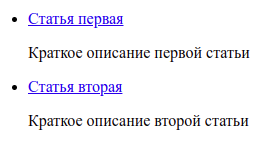

<a name="readme-top"></a>

<!-- PROJECT SHIELDS -->
<!--
*** I'm using markdown "reference style" links for readability.
*** Reference links are enclosed in brackets [ ] instead of parentheses ( ).
*** See the bottom of this document for the declaration of the reference variables
*** for contributors-url, forks-url, etc. This is an optional, concise syntax you may use.
*** https://www.markdownguide.org/basic-syntax/#reference-style-links
-->

[![Contributors][contributors-shield]][contributors-url]
[![Forks][forks-shield]][forks-url]
[![Stargazers][stars-shield]][stars-url]
[![Issues][issues-shield]][issues-url]
[![MIT License][license-shield]][license-url]

Читать на других языках: [English](README.md)

<!-- PROJECT LOGO -->
<br />
<div align="center">
  <a href="https://github.com/injashkin/md-pug-to-html">  
    
  </a>

<h3 align="center">MdPugToHtml</h3>

  <p align="center">
    Компилирует HTML страницы из файлов Markdown с учетом Pug шаблона.
    <br />
    <a href="https://github.com/injashkin/md-pug-to-html/blob/main/README.ru.md"><strong>Изучите документацию »</strong></a>
    <br />
    <br />
    <a href="https://github.com/injashkin/md-pug-to-html">Демонстрация</a>
    ·
    <a href="https://github.com/injashkin/md-pug-to-html/issues">Отчет об ошибках</a>
    ·
    <a href="https://github.com/injashkin/md-pug-to-html/issues">Хотелки</a>
  </p>
</div>

<!-- TABLE OF CONTENTS -->
<details>
  <summary>Содержание</summary>
  <ol>
    <li>
      <a href="#о-проекте">О проекте</a>
      <ul>
        <li><a href="#используемые-технологии">Используемые технологии</a></li>
      </ul>
    </li>
    <li><a href="#установка">Установка</a></li>   
    <li><a href="#использование-с-помощью-CLI">Использование с помощью CLI</a></li>
    <li><a href="#использование-с-помощью-API">Использование с помощью API</a></li>
    <li><a href="#дальнейшее-развитие">Дальнейшее развитие</a></li>
    <li><a href="#участие-в-проекте">Участие в проекте</a></li>
    <li><a href="#лицензия">Лицензия</a></li>
    <li><a href="#контакты">Контакты</a></li>
    <li><a href="#благодарности">Благодарности</a></li>
    <li><a href="#дополнительно">Дополнительно</a></li>
  </ol>
</details>

<!-- ABOUT THE PROJECT -->

## О проекте

MdPugToHtml c помощью шаблонизатора Pug преобразует файлы Markdown в HTML страницы. Эти страницы сохраняются в указанном каталоге с сохранением полной структуры каталога источника. Файлы Markdown могут содержать Frontmatter[1] данные. Эти данные будут использованы как метаданные HTML страниц.

Потребность в MdPugToHtml возникла при создании сборщика [npm-for-frontend](https://github.com/injashkin/npm-for-frontend), но плагин может использоваться независимо.

[1] Markdown Frontmatter - это выделенный тремя дефисами `---` раздел в начале файла markdown, который имеет формат YAML/TOML. Вот пример frontmatter markdown в формате YAML:

```
---
title: Краткий справочник по командам Git
created: 2019-05-20
---

## Полезные команды по работе с Git и Github
```

<p align="right">(<a href="#readme-top">в начало</a>)</p>

### Используемые технологии

- [![Node.js][nodejs.org]][nodejs-url]
- [![Pug][pug.js]][pug-url]
- [![gray-matter][gray-matter]][graymatter-url]
- [![markdown-to-pug][markdown-to-pug]][markdowntopug-url]

<p align="right">(<a href="#readme-top">в начало</a>)</p>

## Установка

```
npm i -D md-pug-to-html
```

<p align="right">(<a href="#readme-top">в начало</a>)</p>

<!-- USAGE EXAMPLES -->

## Использование с помощью CLI

Ниже показан пример, как можно использовать MdPugToHtml.

Откройте терминал и создайте каталог, например, `my-site`, и перейдите в него:

```
mkdir my-site
cd my-site
```

Создайте файл `package.json`, для этого в терминале введите следующую команду:

```
npm init -y
```

Установите MdPugToHtml:

```
npm i -D md-pug-to-html
```

В корневом каталоге проекта создайте каталог, в котором вы хотите размещать статьи. Пусть это будет каталог `content`, а в нем создайте пару подкаталогов `article1` и `article2`. В каждом из них создайте файл `index.md`.

В файл `content/article1/index.md` скопируйте следующее:

```
---
title: Статья первая
description: Краткое описание первой статьи
create: 2022-08-10
---

## Заголовок h2 в первой статье
```

В файл `content/article2/index.md` скопируйте следующее:

```
---
title: Статья вторая
description: Краткое описание второй статьи
create: 2022-08-11
---

## Заголовок h2 во второй статье
```

Теперь, в корневом каталоге проекта создайте каталог `src`, а в нем каталог `article`, где создайте файл `index.pug` со следующим содержимым:

```pug
block variables

doctype html
html(lang= 'ru')
  head
    meta(charset= 'utf-8')
    meta(name= 'viewport' content= 'width=device-width, initial-scale=1')
    meta(name= 'description' content= description)
    title= title

  body
    block main
      .content
        .article
          .creationDate= `Создано: ${create}`
          include from-md.pug
```

В файле `package.json` настройте MdPugToHtml с необходимыми параметрами:

```json
"scripts": {
  "start": "md-pug-to-html -i=content -t=src/article",
}
```

Значения параметров задаются с помощью ключей:

- ключ `-i` - путь к каталогу, где находятся файлы markdown (обязательный)
- ключ `-o` - путь к каталогу сборки проекта (по умолчанию `docs`)
- ключ `-t` - путь к каталогу шаблона статьи с именем `index.pug` (обязательный)
- ключ `-d` - путь к каталогу, куда будет сгенерирован файл `linkList.pug` (по умолчанию `src/data`)

Из корневого каталога проекта в терминале выполните команду:

```
npm run start
```

В итоге, MdPugToHtml сделает следующее:

- создаст каталог `docs` (если он отсутствовал)

- рекурсивно обойдет в каталоге `content` подкаталоги `article1` и `article2` и найдет в них файлы `index.md`.

- преобразует файлы `index.md` в страницы `index.html` в соответствии с шаблоном `src/article/index.pug` и поместит эти страницы в каталог `docs` с сохранением всей структуры подкаталогов каталога `content`, т. е. в каталоге `docs` будут созданы подкаталоги `article1` и `article2`.

  В файл `docs/article1/index.html` будет скомпилировано следующее:

  ```html
  <!DOCTYPE html>
  <html lang="ru">
    <head>
      <meta charset="utf-8" />
      <meta name="viewport" content="width=device-width, initial-scale=1" />
      <meta name="description" content="Краткое описание первой статьи" />
      <title>Статья первая</title>
    </head>
    <body>
      <div class="content">
        <div class="article">
          <div class="creationDate">Создано: Aug 10 2022</div>
          <h2>Заголовок h2 в первой статье</h2>
        </div>
      </div>
    </body>
  </html>
  ```

  В файл `docs/article2/index.html` будет скомпилировано следующее:

  ```html
  <!DOCTYPE html>
  <html lang="ru">
    <head>
      <meta charset="utf-8" />
      <meta name="viewport" content="width=device-width, initial-scale=1" />
      <meta name="description" content="Краткое описание второй статьи" />
      <title>Статья вторая</title>
    </head>
    <body>
      <div class="content">
        <div class="article">
          <div class="creationDate">Создано: Aug 11 2022</div>
          <h2>Заголовок h2 во второй статье</h2>
        </div>
      </div>
    </body>
  </html>
  ```

- MdPugToHtml сгенерирует файл `src/data/linkList.pug`, который будет содержать массив объектов `points`. Каждый объект массива имеет свойства:
  - `pathFile` - путь к файлу `index.html`
  - `title` - заголовок статьи
  - `description` - краткое описание статьи

Файл `src/data/linkList.pug` может быть использован для создания списка ссылок на статьи в формате блога. Ниже приведен пример того, как это может быть использовано.

Создайте шаблон страницы, где будет выводится Список статей. Для этого в каталоге `src` создайте файл `list.pug`, а в него скопируйте следующее:

```pug
block variables

  include ./data/link-list.pug

doctype html
html(lang= 'ru')
  head
    meta(charset= 'utf-8')
    meta(name= 'viewport' content= 'width=device-width, initial-scale=1')

block main
  .content
    .creationDate= pageCreated
    ul.list__box
      each point in points
        li
          a.list__item(href=point.pathFile)= point.title
          p= point.description
```

В файле `package.json` добавьте строку помеченную знаком `+`:

```json
"scripts": {
  "start": "md-pug-to-html -i=content -t=src/pages/article",
+ "pug": "pug --pretty src/list.pug -o docs",
}
```

Из корневого каталога проекта в терминале запустите следующую команду:

```
npm run pug
```

Будет создан файл `docs/list.html` следующего содержания:

```html
<!DOCTYPE html>
<html lang="ru">
  <head>
    <meta charset="utf-8" />
    <meta name="viewport" content="width=device-width, initial-scale=1" />
  </head>
</html>
<div class="content">
  <div class="creationDate"></div>
  <ul class="list__box">
    <li>
      <a class="list__item" href="article1/index.html">Статья первая</a>
      <p>Краткое описание первой статьи</p>
    </li>
    <li>
      <a class="list__item" href="article2/index.html">Статья вторая</a>
      <p>Краткое описание второй статьи</p>
    </li>
  </ul>
</div>
```

Если открыть данный файл в браузере, то вы увидите список ссылок на статьи с кратким описанием:



Кликнув по ссылке вы перейдете на выбранную статью.

## Использование с помощью API

```js
const mpth = require('md-pug-to-html');

const options = {
  sourceDir: 'content',
  templateDir: 'src/article',
};

// Инициализация
mpth.init(options);

// Список созданных страниц
const list = mpth.getList();
```

В `options` можно указать:

- `sourceDir` - каталог со статьями Markdown (обязательно)
- `templateDir` - каталог с шаблоном для страниц статей (обязательно)
- `destinationDir` - обычно, это каталог сборки проекта (по умолчанию `destinationDir: 'docs'`)
- `dataOutDir` - каталог, где будет хранится файл `link-list.pug` (по умолчанию `dataOutDir: 'src/data',`)

`init()` приводит к созданию всех файлов, указанных в параграфе [Использование с помощью CLI](#использование-с-помощью-CLI).

`getList()` возвращает список созданных страниц в виде массива объектов, в каждом объекте которого содержится:

- `pathFile` - путь к файлу страницы статьи `index.html`
- `title` - заголовок статьи
- `description` - краткое описание статьи

Более подробно читайте в [Использование с помощью CLI](#использование-с-помощью-CLI).

<p align="right">(<a href="#readme-top">в начало</a>)</p>

<!-- ROADMAP -->

## Дальнейшее развитие

Полный список предлагаемых улучшений см. в [открытых Issues](https://github.com/injashkin/md-pug-to-html/issues).

<p align="right">(<a href="#readme-top">в начало</a>)</p>

<!-- CONTRIBUTING -->

## Участие в проекте

Вы можете оказать любую помощь проекту. Примите в нем участие или предложите улучшения открыв ишью. Будет ценен любой ваш вклад. Не забудьте добавить проекту звезду! Заранее спасибо!

Если у вас есть идея, которая сделает проект лучше, можете сделать форк репозитория и создать pull request:

1. Сделайте Fork проекта
2. Создайте свою ветку (git checkout -b injashkin/md-pug-to-html)
3. Внесите изменения в код
4. Зафиксируйте ваши изменения (git commit -m 'Добавлено то-то и то-то')
5. Сделайте Push ветки (git push origin injashkin/md-pug-to-html)
6. Сделайте Pull Request

<p align="right">(<a href="#readme-top">в начало</a>)</p>

## Контакты

Игорь Яшкин - injashkin@gmail.com - https://t.me/jashkin

Ссылка на проект: https://github.com/injashkin/md-pug-to-html

<!-- ACKNOWLEDGMENTS -->

## Благодарности

- [Данный README создан по шаблону Best-README-Template](https://github.com/othneildrew/Best-README-Template)

- [Проект от Джона Грубера (JOHN GRUBER) - создателя Markdown](https://daringfireball.net/projects/markdown/)

- [Интересный проект о Markdown](https://www.markdownguide.org)

## Дополнительно

Пакеты, которые могут быть полезны:

- [markdown-to-pug](https://www.npmjs.com/package/markdown-to-pug) - конвертирует Markdown в Pug

- [markdown-front-matter-json](https://github.com/egavrilov/markdown-front-matter-json) - преобразует Markdown с front-matter в объект JS

- [markdown-it-front-matter](https://www.npmjs.com/package/markdown-it-front-matter)
- [markdown-it-container](https://github.com/markdown-it/markdown-it-container)

- [gray-matter](https://github.com/jonschlinkert/gray-matter) - преобразует Markdown с front-matter в YAML (по умолчанию), но также поддерживает JSON, TOML или Coffee Front-Matter с возможностью установки пользовательских разделителей. Данные может получать из файла и из строки.

- [article-data](https://www.npmjs.com/package/article-data) - преобразует Markdown с front-matter в объект
- [get-md-content](https://github.com/iamstarkov/get-md-content)
- [get-md-date](https://github.com/iamstarkov/get-md-date)
- [get-md-desc](https://github.com/iamstarkov/get-md-desc)
- [get-md-image](https://github.com/iamstarkov/get-md-image)
- [get-md-title](https://github.com/iamstarkov/get-md-title)

- [frontmatter-markdown-to-json](https://www.npmjs.com/package/frontmatter-markdown-to-json)

<p align="right">(<a href="#readme-top">в начало</a>)</p>

<!-- MARKDOWN LINKS & IMAGES -->
<!-- https://www.markdownguide.org/basic-syntax/#reference-style-links -->

[contributors-shield]: https://img.shields.io/github/contributors/injashkin/md-pug-to-html.svg?style=for-the-badge
[contributors-url]: https://github.com/injashkin/md-pug-to-html/graphs/contributors
[forks-shield]: https://img.shields.io/github/forks/injashkin/md-pug-to-html.svg?style=for-the-badge
[forks-url]: https://github.com/injashkin/md-pug-to-html/network/members
[stars-shield]: https://img.shields.io/github/stars/injashkin/md-pug-to-html.svg?style=for-the-badge
[stars-url]: https://github.com/injashkin/md-pug-to-html/stargazers
[issues-shield]: https://img.shields.io/github/issues/injashkin/md-pug-to-html.svg?style=for-the-badge
[issues-url]: https://github.com/injashkin/md-pug-to-html/issues
[license-shield]: https://img.shields.io/github/license/injashkin/md-pug-to-html.svg?style=for-the-badge
[license-url]: https://github.com/injashkin/md-pug-to-html/blob/main/LICENSE.txt
[nodejs.org]: https://img.shields.io/badge/node.js-000000?style=for-the-badge&logo=nodedotjs&logoColor=white
[nodejs-url]: https://nodejs.org/
[pug.js]: https://img.shields.io/badge/Pug-critical?style=for-the-badge&logo=pug&logoColor=white
[pug-url]: https://pugjs.org/
[gray-matter]: https://img.shields.io/badge/GrayMatter-35495E?style=for-the-badge&logo=markdown&logoColor=4FC08D
[graymatter-url]: https://www.npmjs.com/package/gray-matter
[markdown-to-pug]: https://img.shields.io/badge/MarkdownToPug-DD0031?style=for-the-badge&logo=markdown&logoColor=white
[markdowntopug-url]: https://www.npmjs.com/package/markdown-to-pug
